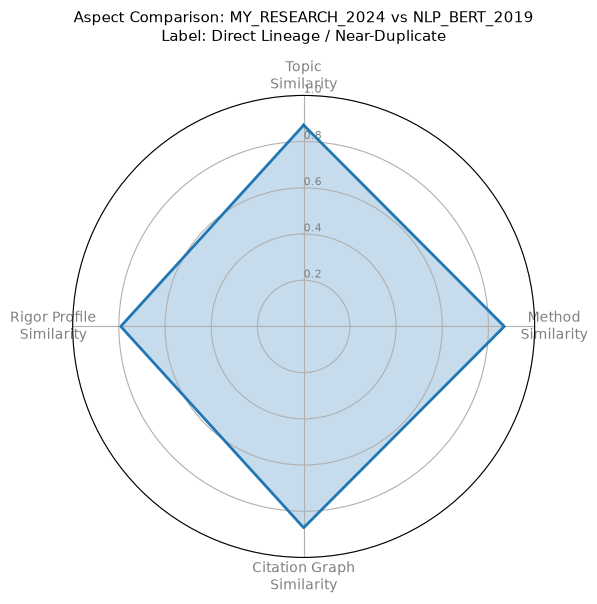

# Multi_Aspect_Disentangled_Embedding_Framework  
Automation of scientific article comparison  

**Installation:**  

pip install torch torch-geometric transformers qdrant-client pydantic scikit-learn numpy spacy pymupdf matplotlib  
python -m spacy download en_core_web_sm  

**Before run it all:**  
python -m venv venv  
venv\Scripts\activate  

**Execute the pipeline entrypoint directly:**  
python main.py  

**Expected Output Log:**  

Initializing ADSE Pipeline encoders...  
 Successfully processed and indexed: paper_001  
 Successfully processed and indexed: paper_002  
 
--- [QUERY 1: Literature Review Search (Focus: Topic + Citation)] ---  
[{'paper_id': 'paper_001', 'composite_score': 1.0}, {'paper_id': 'paper_002', 'composite_score': 0.6421}]  

--- [QUERY 2: Method Borrowing / Novelty Search (Focus: Method)] ---  
[{'paper_id': 'paper_001', 'composite_score': 1.0}, {'paper_id': 'paper_002', 'composite_score': 0.7812}]  

--- [EVALUATION METRICS] ---  
Paper ID: paper_001  
Methodological Novelty Score: 0.2188  
Rigor-to-Impact Ratio:        1.0000  

**Add article's PDFs:**  
python run_extract_and_ingest.py  

**Example of console output:**  
🔍 Found 27 PDF(s) in 'PdfSet1'.  
Initializing ADSE Pipeline encoders...  
Warning: You are sending unauthenticated requests to the HF Hub. Please set a HF_TOKEN to enable higher rate limits and faster downloads.  
Loading weights: 100%|████████████████████████████████████████████████████████████| 199/199 [00:00<00:00, 25522.63it/s]  
Loading weights: 100%|████████████████████████████████████████████████████████████| 199/199 [00:00<00:00, 21717.44it/s]  
[transformers] BertModel LOAD REPORT from: allenai/scibert_scivocab_uncased    

✅ Indexed [paper_001] – Provided proper attribution is provided, Google hereby grants permission to  
✅ Indexed [paper_002] – Published as a conference paper at ICLR 2021  
✅ Indexed [paper_003] – Chain-of-Thought Prompting Elicits Reasoning  
✅ Indexed [paper_004] – Impact of Tokenization on Language Models: An Analysis for Turkish  
✅ Indexed [paper_005] – Large Language Models are Zero-Shot Reasoners  
✅ Indexed [paper_006] – © 2022 IEEE. This is the author’s version of the article that has been published in IEEE Transactions on Visualization and  
✅ Indexed [paper_007] – Published as a conference paper at ICLR 2023  
✅ Indexed [paper_008] – Unnatural language processing:  
✅ Indexed [paper_009] – A Systematic Survey of Prompt Engineering in Large Language Models:  
✅ Indexed [paper_010] – Efficient Prompting Methods for Large Language Models: A  
✅ Indexed [paper_011] – The Prompt Report: A Systematic Survey of Prompt Engineering  
✅ Indexed [paper_012] – Instruction Pre-Training:  
✅ Indexed [paper_013] – Native vs Non-Native Language Prompting:  
✅ Indexed [paper_014] – arXiv:2506.06950v1  [cs.CL]  7 Jun 2025  
✅ Indexed [paper_015] –  
✅ Indexed [paper_016] – On the Dangers of Stochastic Parrots:  
✅ Indexed [paper_017] – Provided proper attribution is provided, Google hereby grants permission to  
✅ Indexed [paper_018] – Unknown Title  
✅ Indexed [paper_019] – DOI 10.1515/cllt-2013-0009   Corpus Linguistics and Ling. Theory 2013; 9(1): 1 – 38  
✅ Indexed [paper_020] – Mind the (Language) Gap:  
✅ Indexed [paper_021] – Volume 10, Issue 3, March – 2025  
✅ Indexed [paper_022] – Language Models are Few-Shot Learners  
✅ Indexed [paper_023] – Original Paper  
✅ Indexed [paper_024] – CONTEMPORARY JOURNAL OF SOCIAL SCIENCE REVIEW  
✅ Indexed [paper_025] – PROMPT ENGINEERING AND THE EFFECTIVENESS OF LARGE  
✅ Indexed [paper_026] – 51  
✅ Indexed [paper_027] – Received 27 July 2024; revised 7 September 2024; accepted 30 September 2024. Date of publication 4 October 2024; date of current version 18 April 2025.  

🚀 All done!  Vector store is ready for queries.
  
🗄️  **CONTENTS OF VECTOR STORE**  
ID: 29698761710  
Payload: {'paper_id': 'paper_023', 'title': 'Original Paper', 'venue': 'Custom Upload', 'year': 2024}  
------------------------------
ID: 35781349760
Payload: {'paper_id': 'paper_002', 'title': 'Published as a conference paper at ICLR 2021', 'venue': 'Custom Upload', 'year': 2024}
------------------------------
ID: 129352152961
Payload: {'paper_id': 'paper_017', 'title': 'Provided proper attribution is provided, Google hereby grants permission to', 'venue': 'Custom Upload', 'year': 2024}
------------------------------
ID: 208676625626
Payload: {'paper_id': 'paper_014', 'title': 'arXiv:2506.06950v1  [cs.CL]  7 Jun 2025', 'venue': 'Custom Upload', 'year': 2024}
------------------------------
ID: 229840648910
Payload: {'paper_id': 'paper_004', 'title': 'Impact of Tokenization on Language Models: An Analysis for Turkish', 'venue': 'Custom Upload', 'year': 2024}
------------------------------
ID: 250135433360
Payload: {'paper_id': 'paper_025', 'title': 'PROMPT ENGINEERING AND THE EFFECTIVENESS OF LARGE', 'venue': 'Custom Upload', 'year': 2024}
------------------------------
ID: 375570028444
Payload: {'paper_id': 'paper_003', 'title': 'Chain-of-Thought Prompting Elicits Reasoning', 'venue': 'Custom Upload', 'year': 2024}
------------------------------
ID: 380741671539
Payload: {'paper_id': 'paper_009', 'title': 'A Systematic Survey of Prompt Engineering in Large Language Models:', 'venue': 'Custom Upload', 'year': 2024}
------------------------------
ID: 389061340577
Payload: {'paper_id': 'paper_027', 'title': 'Received 27 July 2024; revised 7 September 2024; accepted 30 September 2024. Date of publication 4 October 2024; date of current version 18 April 2025.', 'venue': 'Custom Upload', 'year': 2024}
------------------------------
ID: 393088318973
Payload: {'paper_id': 'paper_020', 'title': 'Mind the (Language) Gap:', 'venue': 'Custom Upload', 'year': 2024}
------------------------------
ID: 402204764309
Payload: {'paper_id': 'paper_015', 'title': ' ', 'venue': 'Custom Upload', 'year': 2024}
------------------------------
ID: 412431111409
Payload: {'paper_id': 'paper_026', 'title': '51', 'venue': 'Custom Upload', 'year': 2024}
------------------------------
ID: 430066168314
Payload: {'paper_id': 'paper_016', 'title': 'On the Dangers of Stochastic Parrots:', 'venue': 'Custom Upload', 'year': 2024}
------------------------------
ID: 433136887834
Payload: {'paper_id': 'paper_013', 'title': 'Native vs Non-Native Language Prompting:', 'venue': 'Custom Upload', 'year': 2024}
------------------------------
ID: 436440404836
Payload: {'paper_id': 'paper_011', 'title': 'The Prompt Report: A Systematic Survey of Prompt Engineering', 'venue': 'Custom Upload', 'year': 2024}
------------------------------
ID: 478680215908
Payload: {'paper_id': 'paper_022', 'title': 'Language Models are Few-Shot Learners', 'venue': 'Custom Upload', 'year': 2024}
------------------------------
ID: 579403429177
Payload: {'paper_id': 'paper_012', 'title': 'Instruction Pre-Training:', 'venue': 'Custom Upload', 'year': 2024}
------------------------------
ID: 614010675458
Payload: {'paper_id': 'paper_001', 'title': 'Provided proper attribution is provided, Google hereby grants permission to', 'venue': 'Custom Upload', 'year': 2024}
------------------------------
ID: 629275246269
Payload: {'paper_id': 'paper_008', 'title': 'Unnatural language processing:', 'venue': 'Custom Upload', 'year': 2024}
------------------------------
ID: 684719331738
Payload: {'paper_id': 'paper_019', 'title': 'DOI 10.1515/cllt-2013-0009\u2003\u2003\u2003Corpus Linguistics and Ling. Theory 2013; 9(1): 1\u200a–\u200a38', 'venue': 'Custom Upload', 'year': 2024}
------------------------------
ID: 700813474610
Payload: {'paper_id': 'paper_024', 'title': 'CONTEMPORARY JOURNAL OF SOCIAL SCIENCE REVIEW  ', 'venue': 'Custom Upload', 'year': 2024}
------------------------------
ID: 711106629323
Payload: {'paper_id': 'paper_021', 'title': 'Volume 10, Issue 3, March – 2025     ', 'venue': 'Custom Upload', 'year': 2024}
------------------------------
ID: 746459892396
Payload: {'paper_id': 'paper_006', 'title': '© 2022 IEEE. This is the author’s version of the article that has been published in IEEE Transactions on Visualization and', 'venue': 'Custom Upload', 'year': 2024}
------------------------------
ID: 753470395614
Payload: {'paper_id': 'paper_018', 'title': 'Unknown Title', 'venue': 'Custom Upload', 'year': 2024}
------------------------------
ID: 821701376048
Payload: {'paper_id': 'paper_007', 'title': 'Published as a conference paper at ICLR 2023', 'venue': 'Custom Upload', 'year': 2024}
------------------------------
ID: 904377591822
Payload: {'paper_id': 'paper_010', 'title': 'Efficient Prompting Methods for Large Language Models: A', 'venue': 'Custom Upload', 'year': 2024}
------------------------------
ID: 962447765212
Payload: {'paper_id': 'paper_005', 'title': 'Large Language Models are Zero-Shot Reasoners', 'venue': 'Custom Upload', 'year': 2024}
------------------------------  

**embedded articles comparison with plot output**  
python analyze_my_research.py  
  

